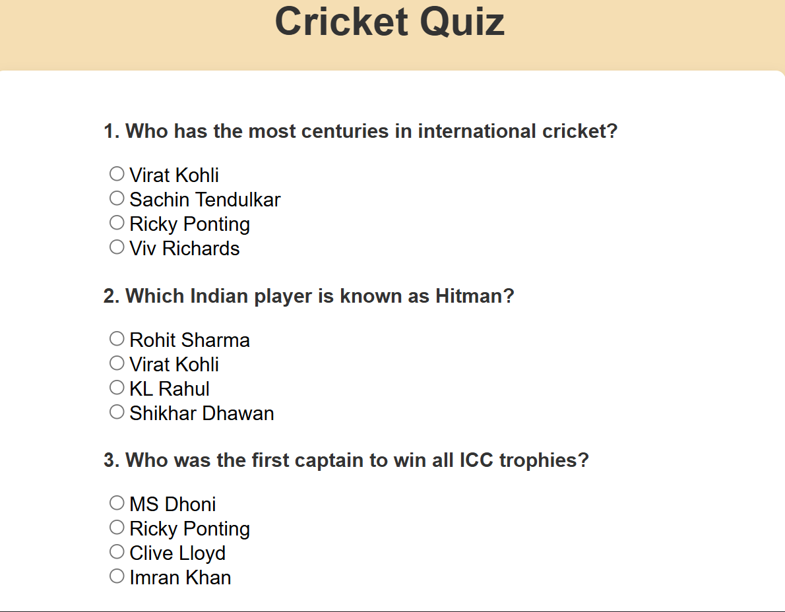

#  Dynamic Quiz App

##  Overview

The **Dynamic Quiz App** is a web-based application built using **Vanilla JavaScript** that generates a quiz dynamically from a pool of questions.

It randomly selects a set of questions, displays them on the screen, and evaluates the user's answers in real-time.

This project demonstrates core concepts of **JavaScript, DOM manipulation, and event handling**.

---

##  Features

*  Randomly selects 5 questions from a pool of 30
*  Multiple choice questions (MCQs)
*  Dynamic UI generation (no hardcoded HTML)
*  Instant score calculation
*  Uses FormData for efficient form handling
*  New questions on every reload

---

##  Technologies Used

* HTML
* CSS
* JavaScript (Vanilla JS)

---

##  How It Works

1. Questions are stored in an array of objects
2. A custom random function selects 5 unique questions
3. Questions are dynamically rendered using JavaScript
4. User selects answers and submits the form
5. FormData collects responses
6. Answers are compared with correct answers
7. Final score is displayed

---

##  Concepts Covered

* DOM Manipulation (`createElement`, `appendChild`)
* Event Handling (`submit`, `click`)
* Form Handling (`FormData`)
* Arrays & Objects
* Randomization logic
* Dynamic UI rendering

---

## Demo

* Select answers → Click Submit
* View your score instantly

---

## Author

Aman Baranwal

